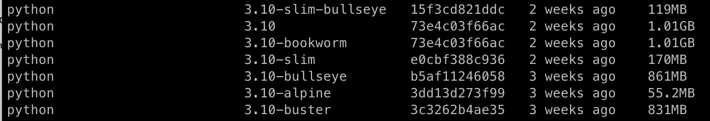

# Docker Images 종류

기본 운영 체제의 차이에 의해 구분된다.

<br>

**Simple Tags**

단일 Linux or Windows 이미지의 인스턴스

**Shared Tags**

여러 버전의 Windows 및 Linux 이미지를 조합

<br>

**사용 방법**

```
FROM python:3.10-slim-bullseye
<메인 프로덕션>:<버전>-<타입>-<타입>
```

**종류**

- 전체 공식 이미지
- stretch/buster/jessie
- slim
- slim-bullseye
- alpine
- windowsservercore

---

<br>

### 전체 공식 이미지

Base 이미지이다.

```
image-name:<version>
```

<br>

### stretch/buster/jessie

데비안 릴리스의 코드명

버전별 코드 네임이다.

|코드명|버전|
|---|---|
|bullseye|11|
|buster|10|
|stretch|9|
|jessie|8|

안정 배포판 버전 12로는 Bookworm이다.

<br>

### slim

최소한의 패키지만 설치한다.

공간을 최소한으로 하여 최소한의 패키지만 필요할 경우 사용한다.

```
image-name:<version>-slim
```

<br>

### slim-bullseye

slim을 특정 데비안 버전과 결합하게 되면 해당 특정 버전에서 운영체제를 실행하는데 가장 필수적인 파일만 포함하여 만들어진다.


<br>

### alpine

Alpine Linux 프로젝트를 기반으로 하며, 컨테이너 내부에서 사용하기 위해 구축된 운영체제이다.

크기가 경량화되어 나왔으며 리눅스 커널을 기반으로 했으며 Musl과 BusyBox를 기반에 두었다.

참고로, BusyBox은 엄청 작은 크키의 바이너리 속에 UNIX 유틸리티 기능이 들어있어 임베디드 환경에서 쓰인다.

리눅스 표준인 GNU 도구 대신 BusyBox가 들어있기 때문에 특정 쉘 명령어가 안될 수도 있다.

```
image-name:<version>-alpine
```

<br>

### windowsservercore

Windows 또는 Windows Server에서만 실행되는 경우 사용

```
image-name:<version>-windowsservercore
```

<br>

---

<br>

python3.10을 기준으로 도커 이미지 크기 비교

```bash
base, bookworm(1.01GB) > bullseye(861MB) > buster(831MB) > slim(170MB) > slim-bullseye(119MB) > alpine(55.2MB)
```


