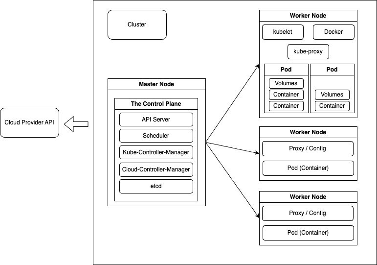

# Kubernetes

컨테이너를 오케스트레이션하는 도구

- 자동 배포
- 스케일링
- 로드밸런싱

<br>

## 쿠버네티스를 사용하는 이유

Container health checks :

Automatic re-deployment :

Autoscaling :

Load balancer :

Management :

쿠버네티스의 경우 위의 각각의 기능들을 독립적으로 정의할 수 있음!

클라우드 프로바이더에 상관없이 사용 가능하며, 추가 구성이 필요한 경우 병합 가능
ex) AWS를 사용할 경우 AWS 서비스에서만 사용 가능(AWS에서 정의한대로 모든 것을 구성해야하기 때문에)
 


<br>


## 쿠버네티스 구성 요소




- Cluster : 배포 혹은 원하는 최종상태를 구성하는 컬렉션 집합, 즉 컨테이너화된 애플리케이션 노드들의 집합
- Nodes : 하나 또는 여러개의 pod를 호스팅하며, 클러스터와 통신하는 물리적 머신 또는 가상 머신
  pod를 호스팅하는 실제 머신이며 앱 컨테이너와 컨테이너의 필요한 리소스를 실행함
  - Master Node : 전체 클러스터를 관리하며, pod를 관리하는 컨트롤 플레인을 가지고 있음
    - The Control Plane : 워커노드 상태를 관리하고 제어한다.
      - API Server : 쿠버네티스 API를 노출하는 쿠버네티스 컨트롤 플레인 컴포넌트
      - Scheduler : 새로운 pod가 생성되면 감지하여 API 서버에 알리는 역할, pod를 어떤 노드에서 실행할지 결정한다.
      - Kube-Controller-Manager : 워커노드 전체를 제어하고 확인
      - Cloud-Controller-Manager : 클라우드 프로바이저(ex) aws)를 API에 연결하는 역할
      - etcd : key:value 형태의 기본 데이터 저장소, 모든 쿠버네티스 클러스터 상태를 저장하고 복제
  - Worker Node : pod를 호스팅하고 컨테이너와 컨테이너 리소스를 실행함
    - kubelet : pod에서 컨테이너가 동작하도록 관리 및 모니터링(pod의 생명주기를 관리), 마스터 노드와 통신
    - kube-proxy : 허용된 트래픽만 pod에 통신 가능하게 한다.
    - Pods : 쿠버네티스의 최소 단위 객체이다. 컨테이너를 실행하여 그 컨테이너를 관리한다. 
      - Containers : 격리된 시스템 자원 및 네트워크를 사용할 수 있는 독립적인 공간
      - Volumes : 데이터를 포함하고 있는 디렉토리 pod 내의 컨테이너들이 접근할 수 있다. (pod가 소멸되면 데이터 또한 소멸되기 때문에 Volume을 사용하여 영속성있게 저장을 한다.)
- Services : 고유한 pod 및 컨테이너의 독립적인 IP 주소를 가진 pod 그룹, pod에 접근하고 IP 주소 및 도메인을 연결
  pod를 그룹화하고, 공유 주소와 공유 ip 주소를 제공(주소를 외부에 노출시킬 때, pod가 새롭게 생성될 경우 ip 주소가 변경되기 때문에 연결시키기 어렵다.


**용어 정리**

Pod:

가장 작고 단순한 쿠버네티스 오브젝트, 사용자 클러스터에서 동작하는 컨테이너 집합

<br>

Deployment:

로컬 상태가 없는 파드를 실행하여 복제된 애플리케이션을 관리하는 API 오브젝트

목표 상태를 정의할 수 있음, 일시정지, 롤백 가능, 스케줄링

```bash
kubectl create deployment [만들 이름] --image=[이미지 이름]

# deployment가 얼마나 있는지 확인
kubectl get deployments

# service를 생성하여, deployment에 의해 생성된 pod를 노출
kubectl expose deployment [deployment 만들 이름] --type=[연결 타입] --port=[노출하려는 포트]
```

<br>
Ingress: 

HTTP와 같이 클러스터 안에 서비스들를 접근하고 관리하기 위한 API 오브젝트

<br>

Service:

Pod 집합에서 실행중인 애플리케이션을 네트워크 서비스로 노출하는 추상화 방법


<br>

## 간단한 튜토리얼

애플리케이션을 minikube에 배포

배포한 애플리케이션 실행

애플리케이션의 로그 확인

쿠버네티스 환경을 볼 수 있는 방법으론 2가지가 있는데,

첫번째, 터미널에서 보는 방법과

두번재, 브라우저에서 보는 방법이 있다.

<br>

0. minikube 실행

```
minikube start
```

<br>

1. 쿠버네티스 대시보드(dashboard) 열기

**터미널에서 보는 방법**

```
minikube dashboard --url
```
이 명령은 대시보드 애드온과 프록시가 활성화된다.
- 옵션 : url (자동으로 웹 브라우저를 열리지 않고 대시보드 접속 url만 출력함)

<br>

**브라우저에서 보는 방법**

```
Select port to view on Host 1 클릭
port : 30000입력
```


<br>

2. 디플로이먼트(deployment) 만들기

```
kubectl create deployment <이름> <이미지> <포트번호>
```

- 디플로이먼트(deployment) 확인

```
kubectl get deployments
```

- 파드(pods) 보기

```
kubectl get pods
```

- 클러스터 이벤트 보기

```
kubectl get events
```

- 환경설정 보기

```
kubectl config view
```

<br>

3. 서비스 만들기

```
kubectl get svc
```


4. 애드온 사용하기 


5. 제거하기

```
kubectl delete service <서비스 이름>
kubectl delete deployment <디플로이먼트 이름>

# 가상 머신 정지
minikube stop

# 가상 머신 삭제
minikube delete
```


## 쿠버네티스 기초 모듈

1. 쿠버네티스 클러스터 생성
2. 애플리케이션 배포
3. 앱 조사
4. 앱 외부로 노출
5. 애플리케이션 스케일링
6. 앱 업데이트


<br>

## 배포 최소 구성 파일(deployment, service)

<br>

배포 구성 파일을 만드는 방법으로는 명령적 접근 방식과 선언적 접근 방식이 있다.

- 명령적 접근 방식
- 선언적 접근 방식
  전체 명령을 반복할 필요가 없다.
  다른 팀원에게 공유하기도 편하며, 직관적이다.


### 명령적 접근 방식

<br>

**실행 방법**

```
minikube service [만든 이름] [--url]
```
옵션 : url

```bash
# deployment
kubectl create deployment [만들 이름] --image=[이미지]

# service
kubectl expose deployment [만든 이름] --port=... --type=LoadBalancer
```


### 선언적 접근 방식

<br>

**실행 방법**

연결된 클러스터에 구성 파일(config file)을 적용

```bash
# 변경 사항 또한 같은 명령어임
kubectl apply -f [파일 이름 or 파일 경로]

# 레이블 별로 객체 삭제
kubectl delete [deployment or service] -l [key=value]
```
옵션: f 파일 식별(한번에 여러 파일을 적용할 경우 -f 옵션을 사용하면 됨)

삭제 방법
```bash
# 파일에 의해 생성된 리소스 삭제
kubectl delete -f=[파일 이름].yaml
kubectl delete -f=[파일안에 정한 이름],[여러개 가능]
```

```yaml
# deployment.yaml

# kubectl create deployment [만들 이름] --image=[이미지]

apiVersion: apps/v1
kind: Deployment
metadata: [만들 이름]
  name: [만들 이름]
# 구성 방법 정의
spec:
  # pod 인스턴스의 수
  replicas: 1
  # deployment에게 어떤 pod인지 알려줌(연결) + 다른 리소스를 리소스에 연결하는데 사용
  selector: 
    matchLabels:
      app: second-app
      key: value
  # pod
  template:
    metadata:
      labels:
        app: second-app
        key: value
    spec:
      containers:
        - name: second-node
          image: [이미지 이름]
        # - name:
        #   image:
```

<br>

### service.yaml

```bash
kubectl apply -f [파일 이름 or 파일 경로]

minikube service backend
```

service를 삭제할 경우 그와 연결된 것도 삭제된다 ex)deployment

```yaml
# service.yaml

# kubectl expose deployment [만든 이름] --port=... --type=LoadBalancer

apiVersion: v1
kind: Service
metadata:
  name: backend
spec:
  selector:
    app: second-app

  ports:
    - protocol: 'TCP'
      # 노출하고자 하는 외부 포트
      port: 80
      # 컨테이너 포트
      targetPort: 8080
    # - protocol: 'TCP'
    #   port: 443
    #   targetPort: 443
  type: LoadBalancer

```

**type**

ClusterIP : 기본 디폴트
NodePort : 기본적으로 실행되는 워커노드의 IP와 포트에 노출

LoadBalancer : 가장 일반적으로 사용

---

또한 이 두 파일(deployment.yaml, service.yaml)을 하나의 파일에 저장할 수 있음

서비스를 앞에 두는 것이 좋다(리소스가 먼저 생성되도록 하기 위해)

"---" 으로 구분시킨다.

```yaml
# master-deployment.yaml

# service
apiVersion: v1
kind: Service
metadata:
  name: backend
spec:
  selector:
    app: second-app

  ports:
    - protocol: 'TCP'
      # 노출하고자 하는 외부 포트
      port: 80
      # 컨테이너 포트
      targetPort: 8080
    # - protocol: 'TCP'
    #   port: 443
    #   targetPort: 443
  type: LoadBalancer
---
# deployment
apiVersion: apps/v1
kind: Deployment
metadata: [만들 이름]
  name: [만들 이름]
# 구성 방법 정의
spec:
  # pod 인스턴스의 수
  replicas: 1
  # deployment에게 어떤 pod인지 알려줌
  selector: 
    # matchExpressions:
    #   - {key: app, values: [second-app, 등등]}
    matchLabels:
      app: second-app
      key: value
  # pod
  template:
    metadata:
      labels:
        app: second-app
        key: value
    spec:
      containers:
        - name: second-node
          image: [이미지 이름]
          # 컨테이너가 실행중인지 확인
          livenessProbe:
            httpGet:
              path: /
              port: 8080
              # 작업 수행 빈도
              periodSeconds: 10
              # 상태를 확인할때가지 기다리는 시간
              initialDelaySeconds: 5

```

selector의 matchLabels와 matchExpressions(더 최신)
matchLabels : 레이블에 키 값 쌍이 여러개 중첩
matchExpressions : 중괄호로 정의 {key: app, values: [허용하려는 값 목록]}, operator도 사용가능
